# ARIP User Guide
## Academic Recognition Intelligence Platform

This guide helps you use ARIP (Academic Recognition Intelligence Platform) based on your role. Select your user type below to find the relevant instructions.

---

## Choose Your Role

| Role | Description | Go To |
|------|-------------|-------|
| 🎓 **Student** | Submit course recognition applications | [Student Guide](#-student-guide) |
| 👔 **Staff** | Review and manage all student applications | [Staff Guide](#-staff-guide) |
| 👨‍🏫 **Professor** | Evaluate courses for modules you teach | [Professor Guide](#-professor-guide) |

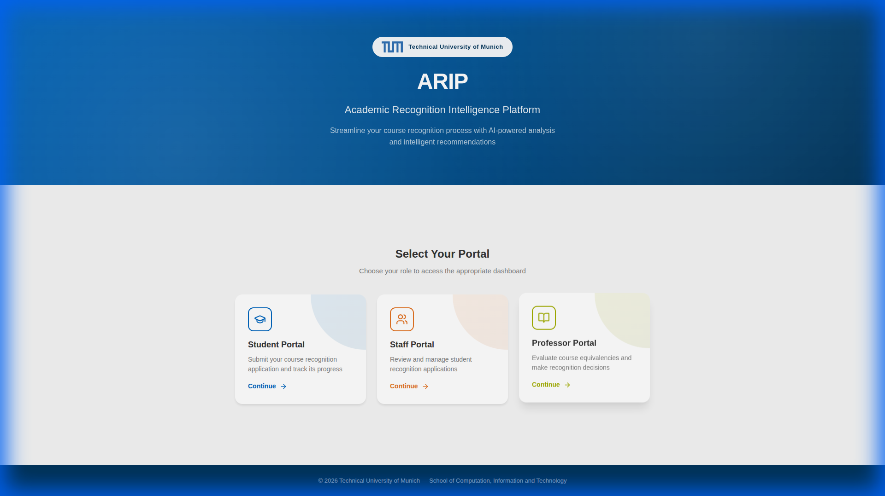

---

# 🎓 Student Guide

As a student, you will submit your course recognition application through a 4-step process.

## Getting Started

1. Go to the ARIP landing page
2. Click **"Student Portal"**
3. Follow the steps below

## Step 1: Personal Data

Enter your personal and academic information.

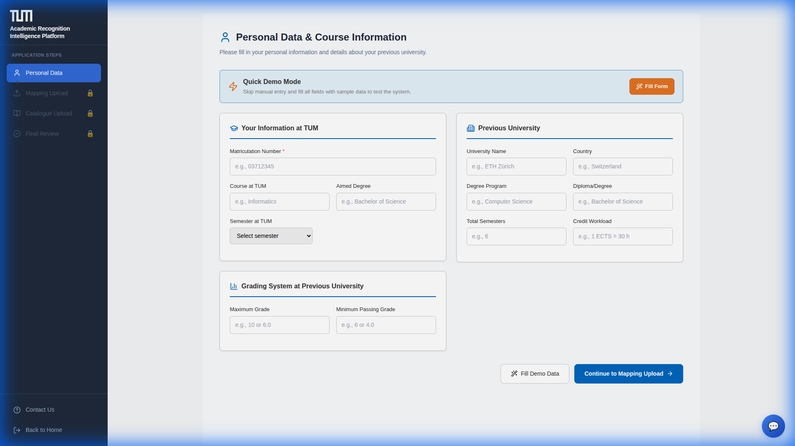

**Required Fields:**

| Section | What to Enter |
|---------|---------------|
| **TUM Information** | Matriculation Number, Course, Degree, Semester |
| **Previous University** | University Name, Country, Program, Total Semesters |
| **Grading** | Maximum Grade, Minimum Passing Grade |

> [!NOTE]
> Demo buttons shown in screenshots are for testing only and removed in production.

---

## Step 2: Mapping Upload

Specify which TUM modules you want recognized and map source courses to them.

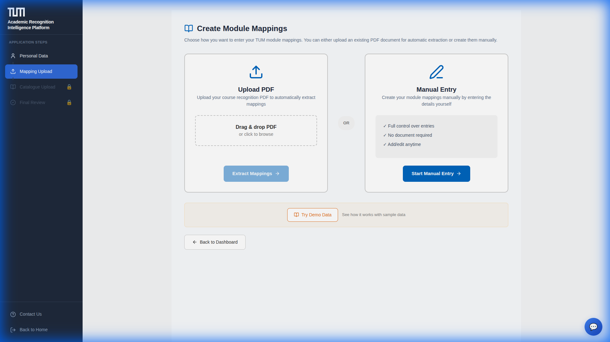

**Options:**
- **Upload PDF** – AI automatically extracts mappings
- **Manual Entry** – Create mappings yourself

---

## Step 3: Catalogue Upload

Upload course catalogue PDFs from your previous university.

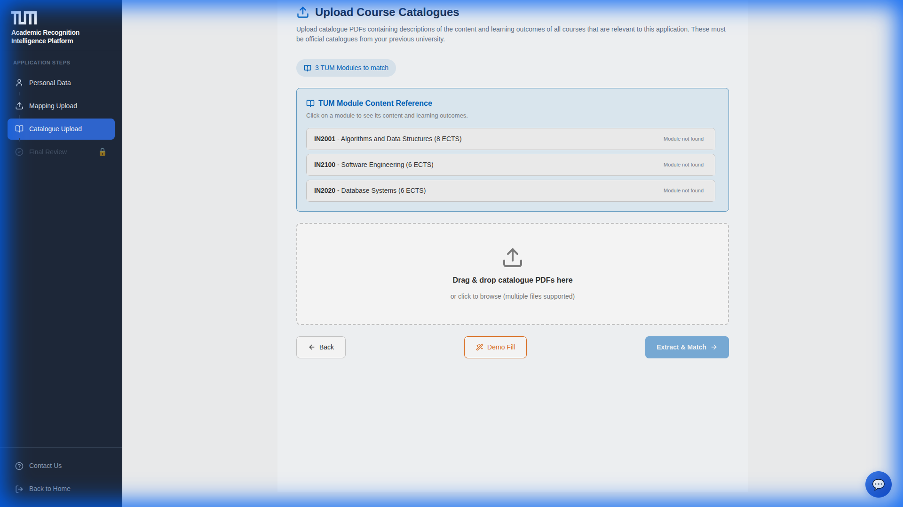

**Process:**
1. Upload catalogue PDFs (drag & drop or browse)
2. Click **"Extract & Match"** for AI extraction
3. The extracted content will be sent to staff for review

---

## Step 4: Final Review & Submit

Review all your data before submitting.

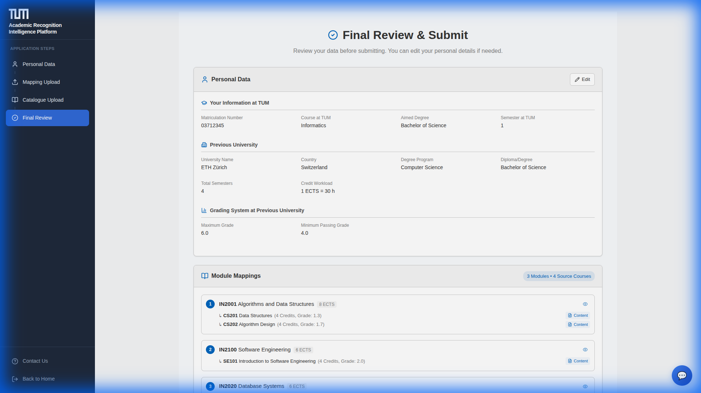

> [!IMPORTANT]
> Once submitted, you cannot modify your application. Review carefully!

---

## Tracking Your Application

After submission, track your application status.

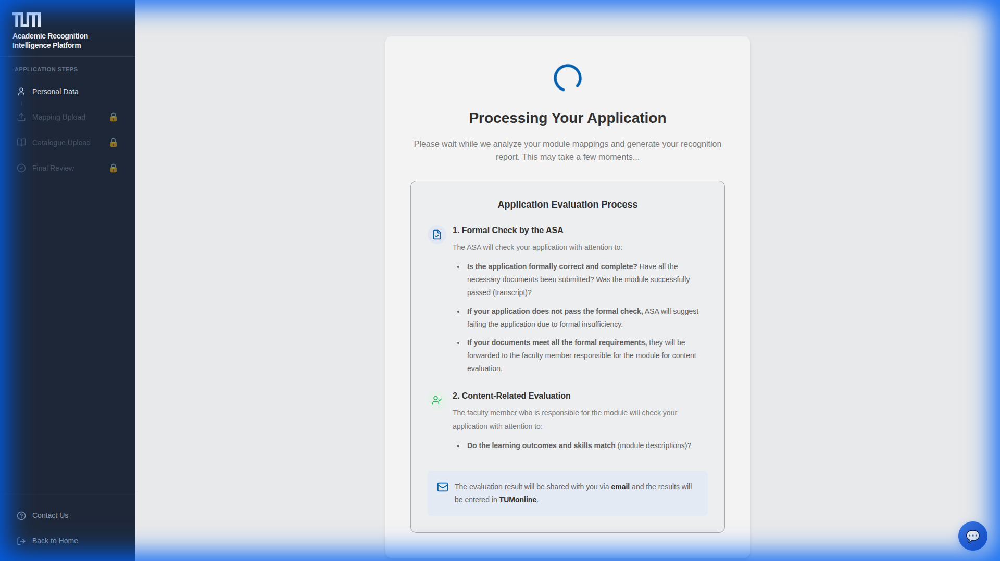

| Status | Meaning |
|--------|---------|
| **Processing** | AI is analyzing your application |
| **Pending Review** | Awaiting staff review |
| **On Hold** | Additional info requested |
| **Approved** | Recognition granted ✅ |
| **Rejected** | Recognition denied ❌ |

---

## AI Chatbot Assistant

Need help while filling your application? The chatbot is always available!

**How to use:**
1. Click the **chat icon (💬)** in the bottom-right corner
2. Type your question (e.g., "How long does the process take?")
3. Get instant answers based on TUM guidelines

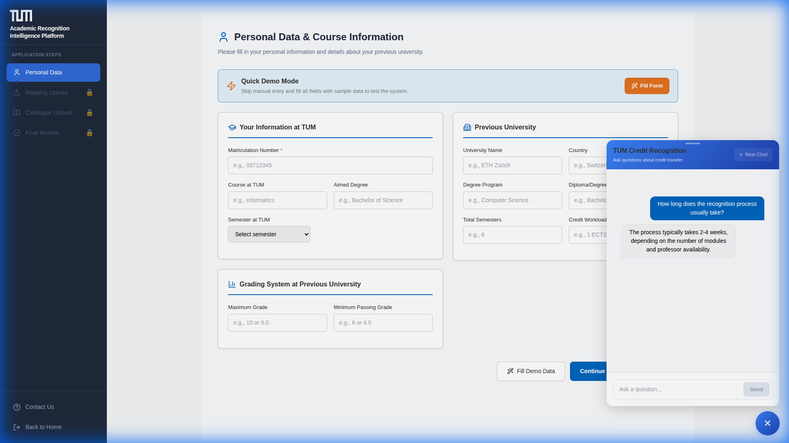

---

# 👔 Staff Guide

As staff (e.g., ASA coordinator), you have an **overview of all applications** across all modules. Professors make the approval/rejection decisions for their modules.

## Tasks View

Your main dashboard showing all pending reviews.

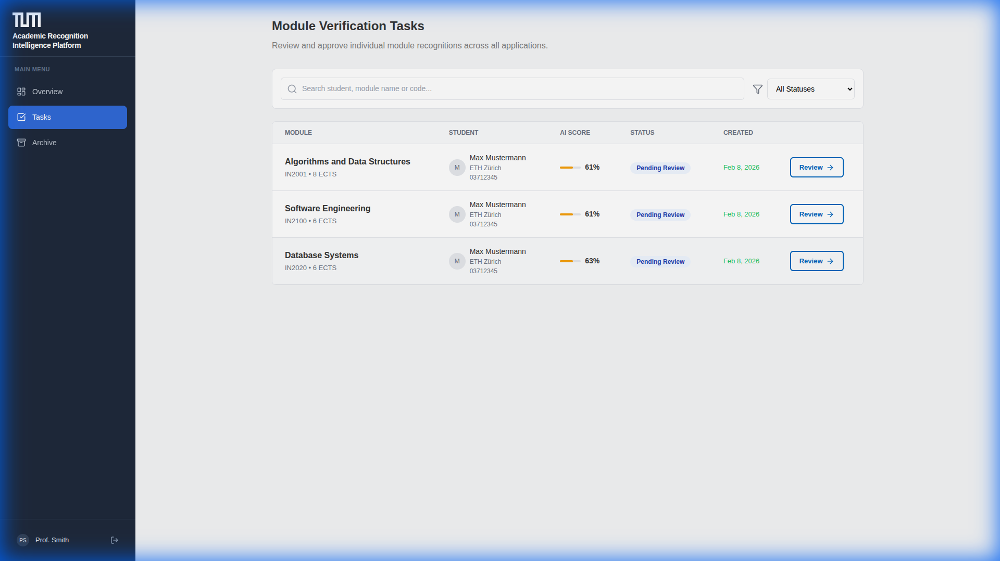

**Features:**
- Search by student, module, or code
- Filter by status
- View AI scores at a glance
- Click **"Review"** to open details

**AI Score Guide:**

| Score | Meaning | Action |
|-------|---------|--------|
| 80-100% | Highly equivalent | Likely approval |
| 60-79% | Partial match | Requires Professor Inspection |
| 0-59% | Insufficient | Very careful review / May be rejected by staff |

---

## Task Detail & AI Analytics

Click "Review" to see full details and AI analysis.

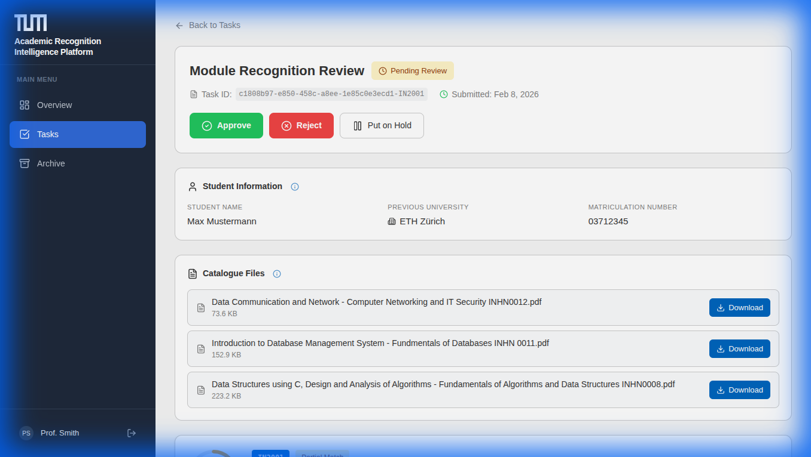

### Actions (for professors)
| Button | What It Does |
|--------|--------------|
| **Approve** | Grant recognition |
| **Reject** | Deny with feedback |
| **Put on Hold** | Request more info |

> [!NOTE]
> Staff can view these details but professors are responsible for the decision.

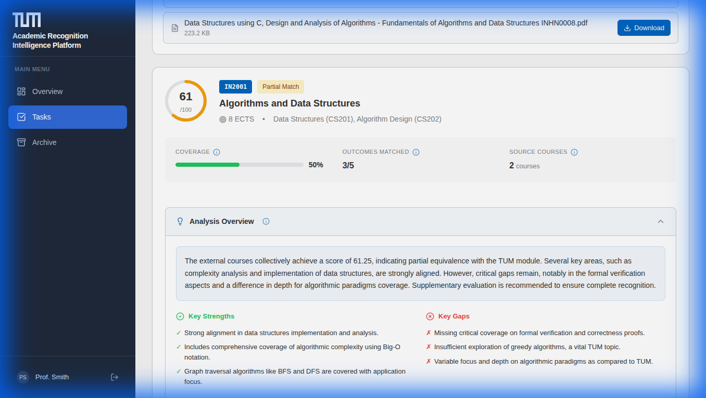

**AI Analysis Overview:**
- **Score Card**: Instant 0-100% match rating
- **Strengths & Gaps**: High-level summary of covered/missing topics
- **Assessment Quality**: reliability metric of the source documents

### 🔍 Deep Dive: The 5 Analytics Sections

The AI analysis is divided into **5 expandable sections** to help you make an informed decision.

> [!CAUTION]
> **AI is Advisory Only.** The analysis is generated to assist you, but the **Professor always makes the final decision**.
> You can always download the **original PDF documents** from the "Catalogue Files" card to verify the content manually.

#### 1. Analysis Overview (Default View)
- **Score Ring**: Instant 0-100% equivalence rating.
- **Key Strengths/Gaps**: Bullet points highlighting covered vs. missing topics.

#### 2. Assessment Quality
- **Confidence Score**: How sure the AI is about its result.
- **Input Quality**: Warns if the uploaded PDF was blurry or incomplete.

#### 3. Learning Outcome Details
Use this to see exactly *which* topics matched:

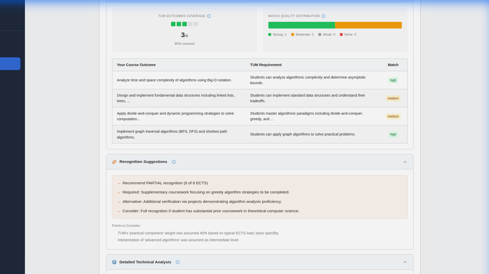

- **Coverage Visualization**: Green squares represent covered TUM learning outcomes.
- **Comparison Table**: Side-by-side view of the student's syllabus vs. TUM requirements.

#### 4. Recognition Suggestions
- **Actionable Advice**: The AI suggests whether to grant full credit, partial credit, or require a supplementary exam.
- **Ambiguity Notes**: Highlights areas where the syllabus was vague.

#### 5. Detailed Technical Analysis (Professor View)
Designed for the chair's decision-maker, this section provides the "why":

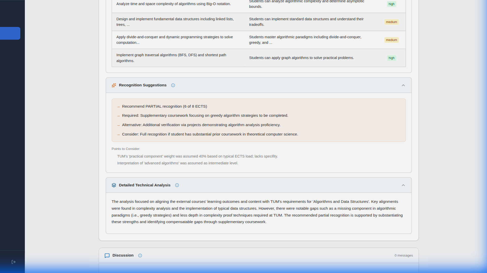

- **Methodology**: Explains the logic behind the score.
- **Syllabus Citation**: References specific text from the student's uploaded documents.
- **Gap Reasoning**: Technical explanation of why a topic was marked as missing (e.g., "Student covered *Heaps*, but missing *Fibonacci Heaps*").

> [!TIP]
> Use the **"Recognition Suggestions"** dropdown to see actionable advice (e.g., "Grant 4 ECTS", "Require supplementary exam").

> [!IMPORTANT]
> **AI is advisory only.** The AI analysis helps speed up review but **can be incorrect**. The final decision is always made by a human (the professor). Original PDFs are always available for manual verification.

---

## Discussion with Professors

Professors and staff can discuss modules before making decisions.

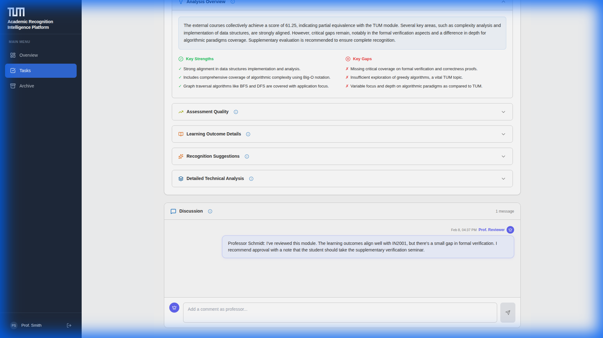

*Example: Professor Schmidt recommends approval with a note about a supplementary seminar.*

**How to use Discussion:**
1. Professor reviews the AI analysis
2. Professor posts recommendation with reasoning
3. Staff reviews professor input before final decision

---

## Kanban Board

Visual overview of all tasks by status.

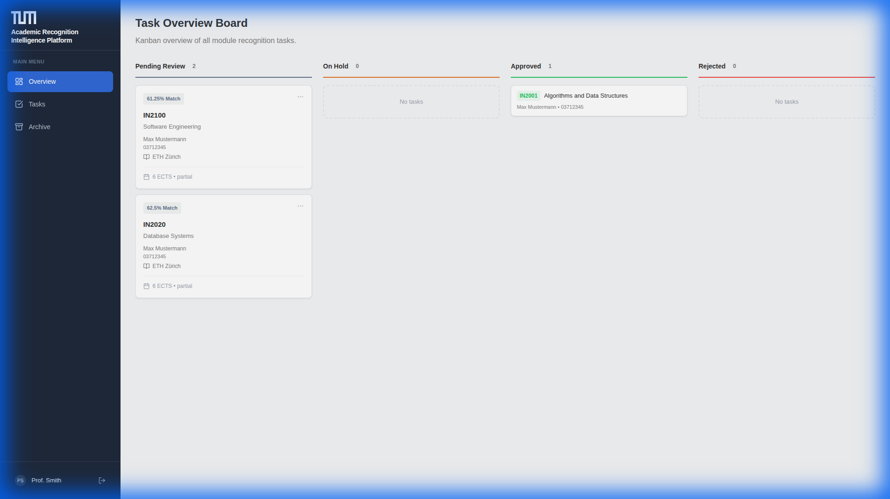

**Columns:** Pending Review → On Hold → Approved / Rejected

---

## Archive

Access historical records of all processed applications.

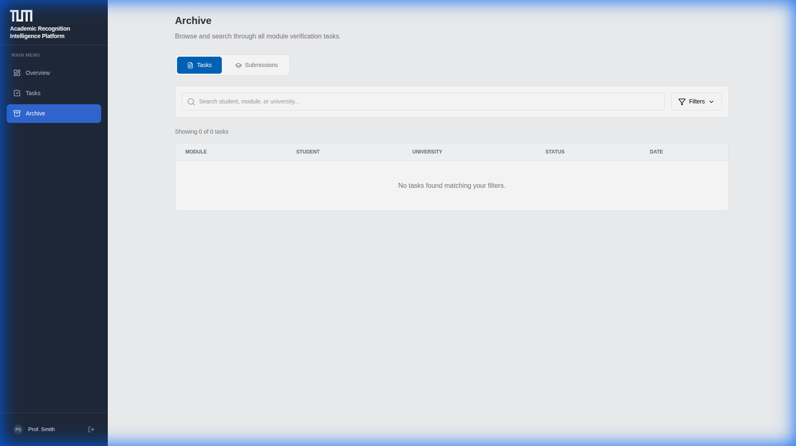

---

# 👨‍🏫 Professor Guide

As a professor, you **evaluate and make decisions** on course equivalencies for **modules of your chair**.

## How It Differs from Staff View

| Feature | Staff | Professor |
|---------|-------|-----------|
| **Scope** | Overview of all modules | Only modules of your chair |
| **Decision Power** | Reject / Put on Hold | Approve / Reject / Put on Hold |
| **Archive** | Complete history | Only modules of your chair |

## Your Workflow

1. **Receive notification** when a student applies for your module
2. **Review the AI analysis** – see match scores and gap analysis
3. **Check source course content** – compare to your module requirements
4. **Use Discussion** – communicate with staff if needed
5. **Make the decision** – Approve, Reject, or Put on Hold

## Making a Decision

When approving or rejecting, you must provide a final verdict message.

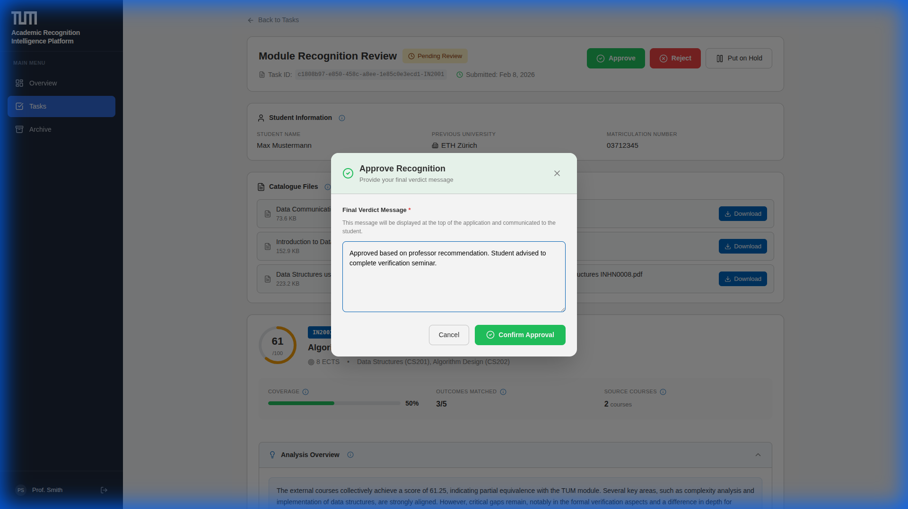

**Steps:**
1. Click **Approve** (or Reject)
2. Enter your **Final Verdict Message** (required)
3. Click **Confirm Approval**

The verdict is recorded in history and communicated to the student.

## Discussion Feature

Use the Discussion section to:
- Communicate with staff about the application
- Document your reasoning
- Request additional documentation

---

*ARIP v1.0 – Academic Recognition Intelligence Platform*
*© 2026 Technical University of Munich*
